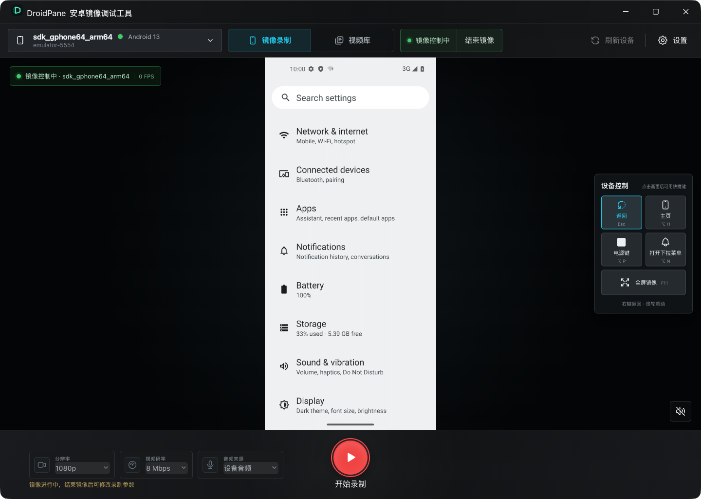
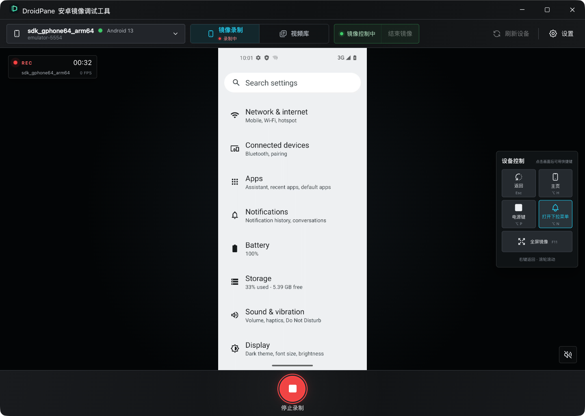
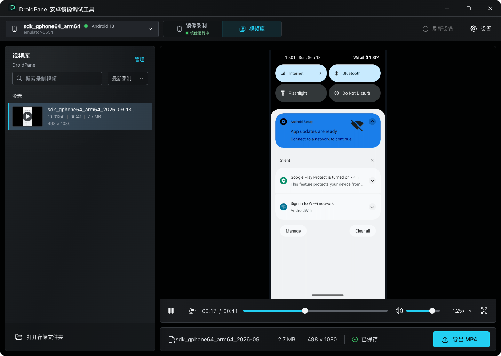

[English](README.md) | **简体中文**

<p align="center">
  
</p>

# DroidPane

**Android Mirror & Debug — 安卓镜像调试工具。**

DroidPane 将 Android 屏幕镜像、鼠标键盘控制、录屏和视频管理放在同一个
桌面工作台中。适合演示手机应用、复现操作问题、录制教程，以及保存测试过程。

基于 Electron 43.2、React 19、TypeScript 与 scrcpy 4.1，支持 macOS 与
Windows。镜像和录制拥有独立的生命周期：可以先操作设备，需要时再开始录制，
停止录制后继续使用镜像。

## 功能一览

| 功能 | 可以做什么 |
| --- | --- |
| 设备选择 | 识别 ADB 已连接的 USB 设备、网络设备和安卓模拟器，展示型号、系统版本、序列号及连接状态。 |
| 实时镜像 | 在桌面查看 Android 画面，支持全屏显示，并显示镜像状态与实时帧率。 |
| 鼠标控制 | 直接点击、拖动和滚动镜像画面，右键返回；侧边面板提供返回、主页、电源键和通知栏控制。 |
| 键盘输入 | 输入中英文、粘贴文本，并使用常见编辑键和快捷键操作设备。 |
| 独立录屏 | 镜像期间随时开始、停止录制，结束录制不会关闭镜像；录制中显示计时和状态。 |
| 画质选择 | 提供 720p、1080p、原始分辨率，以及 4 / 8 / 16 Mbps 视频码率选项。 |
| 音频采集 | 可选择设备内部音频或静音录制；支持时直接生成包含 H.264 视频和 AAC 音频的 MP4。 |
| 电脑监听 | 独立开关电脑端音频监听、调整监听音量，监听设置不改变录制文件音量。 |
| 视频库 | 自动读取录制文件、生成真实视频帧缩略图，支持按文件名搜索、按录制时间排序。 |
| 内置播放器 | 播放、暂停、拖动进度、后退 10 秒、调整音量、全屏，以及 1× / 1.25× / 1.5× / 2× 倍速播放。 |
| 文件管理 | 查看时长、分辨率、大小和音轨信息，无损导出 MP4，打开所在目录，单个或批量移至系统回收站。 |
| 存储设置 | 自选录制目录，保存画质和监听偏好，下次打开继续使用。 |

切换到视频库时，镜像与录制仍可在后台继续运行。录制期间可以播放历史视频，
删除视频和修改存储位置会暂时锁定；调整画质参数需要先结束镜像。

## 功能演示

使用 **Android 13 模拟器**实录，时长约 **1 分 32 秒**。演示包含镜像中的
点击、返回和滚动，通知栏控制，开始/停止录制，以及视频库回放。
视频剪去了等待片段；截图和画面均来自实际运行。

https://github.com/user-attachments/assets/e39b22ca-ded8-4b2a-b27e-e40167acd951

[查看或下载演示 MP4](docs/media/droidpane-demo.mp4) · [演示环境与素材说明](docs/media/README.md)

| 时间 | 演示内容 |
| --- | --- |
| 00:00 | 实时镜像，点击进入系统设置项 |
| 00:12 | 录制过程，返回与滚轮浏览 |
| 00:30 | 打开 Android 通知栏 |
| 00:38 | 关闭通知栏、停止录制，镜像继续运行 |
| 00:56 | 进入视频库，查看缩略图和文件信息 |
| 01:18 | 在内置播放器中回放录制内容 |

## 界面预览

以下截图来自 DroidPane 连接 Android 13 模拟器的实际运行界面。

### 镜像与设备控制



### 录制进行中



### 视频库与播放



## 快速上手

1. 启动安卓模拟器，或连接已开启 **USB 调试** 的 Android 设备。真机首次连接时，在设备上确认调试授权。
2. 打开 DroidPane，点击 **刷新设备**，选择要操作的设备。
3. 选择分辨率、视频码率和音频来源，点击 **开启镜像控制**。
4. 直接在镜像画面内操作设备。需要记录过程时，点击 **开始录制**。
5. 停止录制后，进入 **视频库** 查看视频，或点击完成通知中的 **查看视频**。
6. 需要分享时，选择视频并点击 **导出 MP4**；结束操作后点击 **结束镜像**。

网络设备需要先通过 ADB 完成连接；DroidPane 会读取已建立的 ADB 连接。
应用自带所需运行时，日常使用无需另外安装 scrcpy。

## 镜像控制

录制以用户显式开启的镜像为前置条件，操作顺序为“选择参数 → 开启镜像
→ 开始/停止录制 → 主动结束镜像”。镜像期间可在画面中点击、拖动、
滚轮滚动、右键返回，也可直接输入中英文或粘贴文本。录制会从下一个
关键帧开始，停止录制后镜像、设备控制与电脑端音频监听保持连续。

镜像画面获得焦点后支持以下快捷键（macOS 使用 Option）：

- `Esc`：返回
- `Alt/Option + H`：主页
- `Alt/Option + P`：电源键
- `Alt/Option + N`：打开设备下拉菜单
- `F11`：切换全屏镜像

## 开发

需要 Node.js 22.14.0 或更高版本。

```bash
git clone https://github.com/asd116725/droidpane.git
cd droidpane
npm install
npm run fetch:scrcpy
npm start
```

常用验证命令：

```bash
npm test -- --no-watchman
npm run typecheck
npm run lint
npm run package
```

## 内置运行时

`vendor/scrcpy/manifest.json` 锁定了以下 scrcpy 4.1 官方发行包与 SHA-256：

- macOS Apple Silicon：`scrcpy-macos-aarch64-v4.1.tar.gz`
- macOS Intel：`scrcpy-macos-x86_64-v4.1.tar.gz`
- Windows x64：`scrcpy-win64-v4.1.zip`

`scripts/fetch-scrcpy.mjs` 会在开发或打包前下载、校验并解压当前目标。
解压后的运行时目录不会提交到版本库，但会作为 `extraResource` 进入安装包。

## 打包

本机打包当前架构：

```bash
npm run make
```

macOS 交叉构建架构：

```bash
npm run make -- --arch=arm64
npm run make -- --arch=x64
```

对应产物为：

- `out/make/DroidPane-arm64.dmg`
- `out/make/DroidPane-x64.dmg`

Windows MSI 需要在已安装 WiX Toolset v3 的 Windows runner 上构建。
安装向导支持选择安装目录，并会在 Windows“已安装的应用”中注册
卸载入口。仓库中的 `.github/workflows/build-installers.yml` 会分别
产出 macOS x64 DMG、macOS arm64 DMG 与 Windows x64 MSI。Windows 产物
位于 `out/make/wix/x64/`。

## 开发构建启动

macOS 开发构建使用 ad-hoc 临时签名，尚未进行 Apple 公证；Windows MSI
尚未进行代码签名。

- macOS：首次打开若被系统阻止，在“系统设置 → 隐私与安全性”中选择
  “仍要打开”；或在 Finder 中按住 Control 点击应用并选择“打开”。
- Windows：SmartScreen 出现提示时选择“更多信息 → 仍要运行”。

## 录制兼容性

- Android 5.0+：支持视频录制。
- Android 11–12：使用 `output` 设备音频。
- Android 13+：使用 `playback` 与音频复制。
- Android 10 及以下或音频初始化失败：自动降级为静音录制并在界面说明。

录制文件直接保存到系统“视频/DroidPane”目录，导出过程只做字节
复制，不重新编码。

## 安全边界

渲染进程启用隔离与沙箱，不具备 Node.js 权限。预加载层只公开固定的设备、
录制、导出、设置和窗口控制方法；所有 IPC 参数与发送方均在主进程校验。
视频预览使用内部 UUID 映射的自定义协议，渲染进程不会获得任意本地文件路径。

## 许可证

DroidPane 源码采用 [MIT License](LICENSE)。

随安装包分发的 scrcpy、ADB、FFmpeg 等第三方组件保留各自的许可证，
详见 [第三方声明](licenses/SCRCPY-THIRD-PARTY-NOTICES.md) 和 [licenses](licenses/) 目录。
